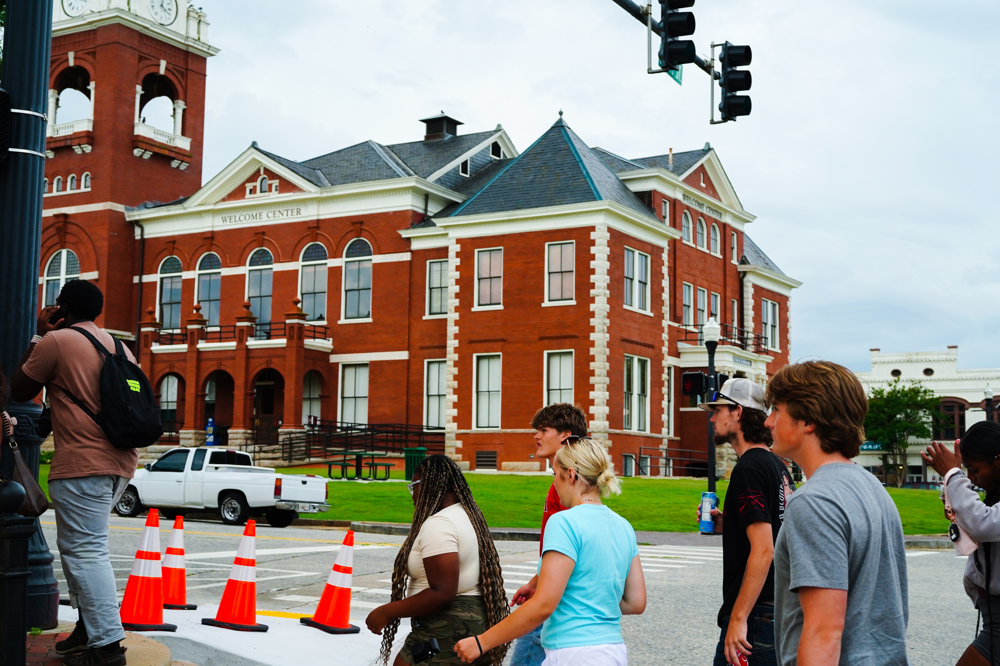
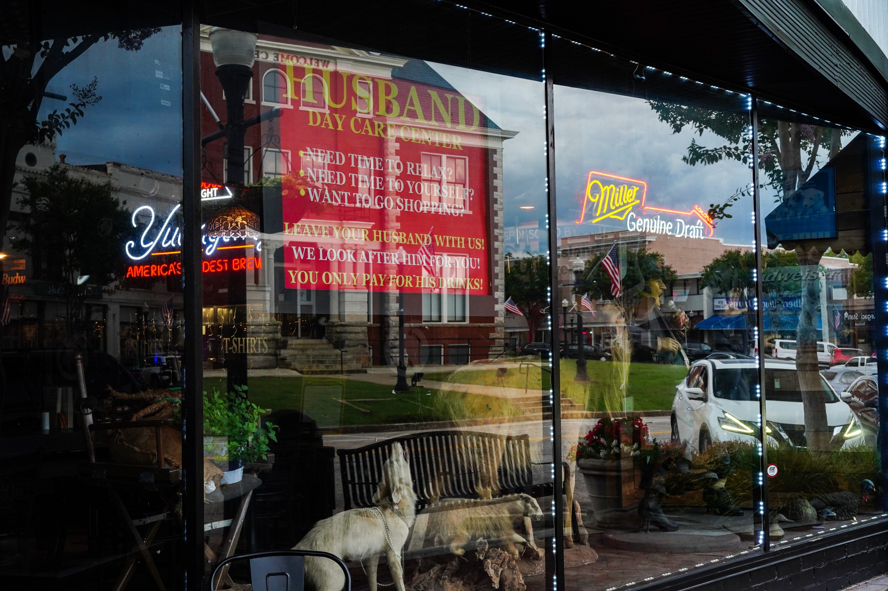
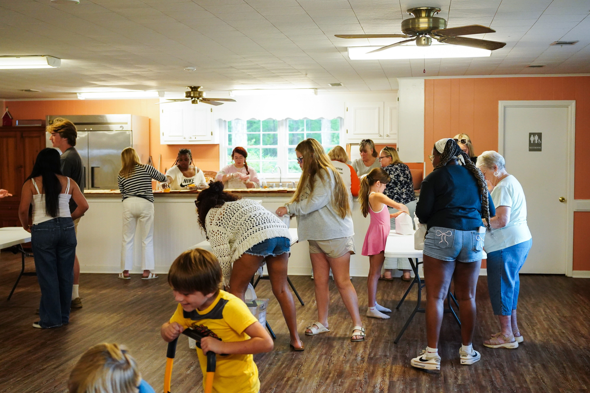
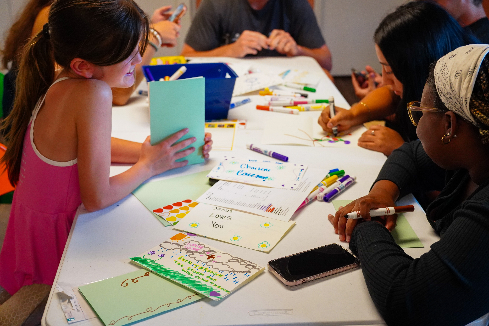
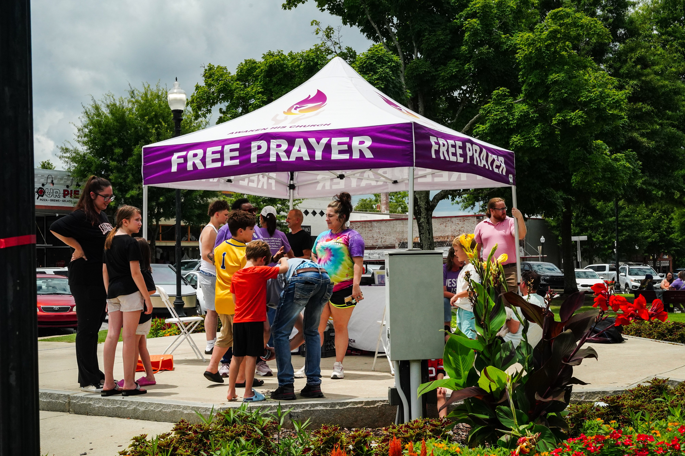
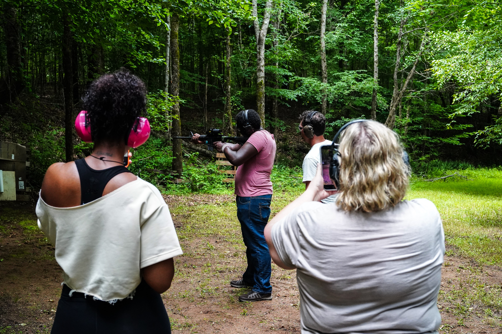
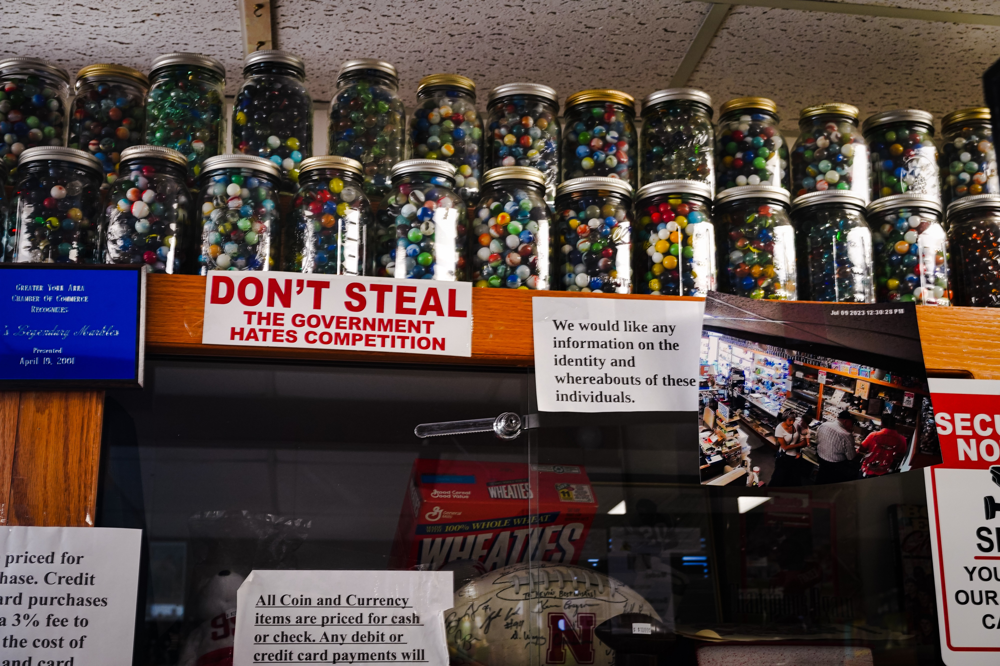
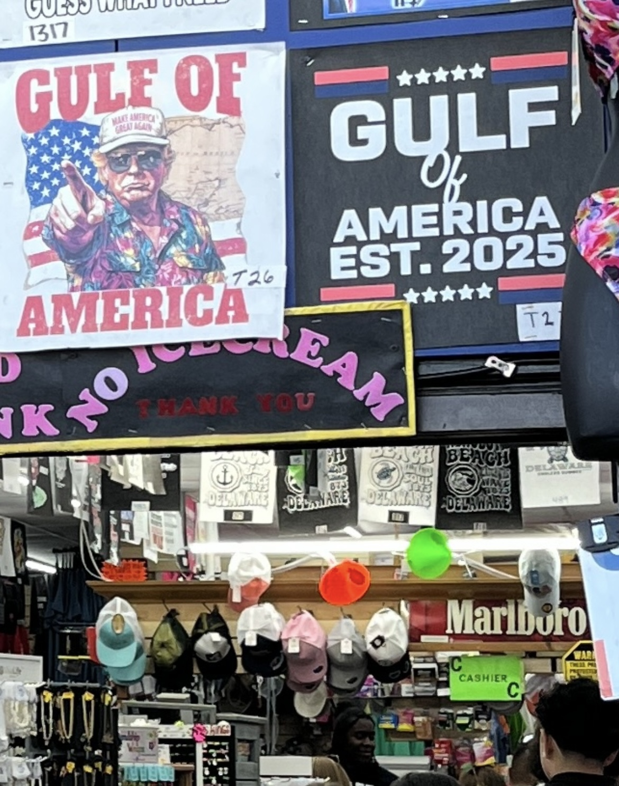

```{=html}
<style>
/* Stretch the photo grids to (nearly) full viewport width */
#quarto-document-content .quarto-layout-panel {
  width: 96vw;
  max-width: none;
  position: relative;
  left: 50%;
  transform: translateX(-50%);
}
</style>
```

A few photos I've taken of American life.

## 2026

::: {layout-ncol=3}
{group="2026"}

{group="2026"}

{group="2026"}

{group="2026"}

{group="2026"}

{group="2026"}
:::

## 2025

::: {layout-ncol=3}
{group="2025"}

{group="2025"}

{group="2025"}
:::
